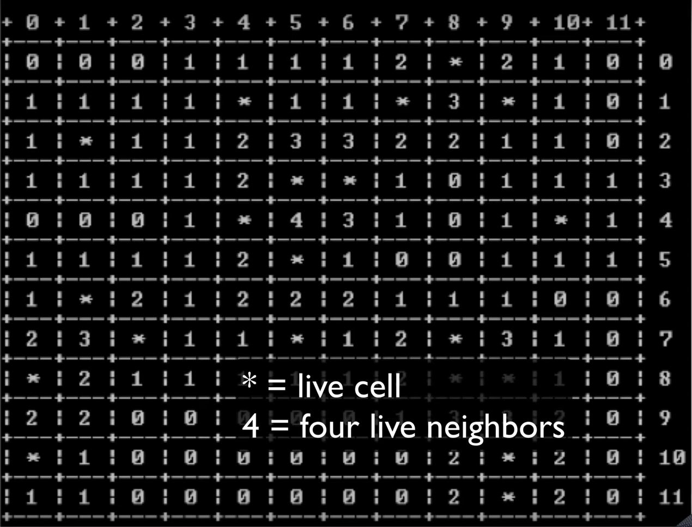

# Milestone 1: Console Application

## Overview

In this milestone, students will create three classes: Cell, Board, and Program.

## Execution

Execute this assignment according to the following guidelines:

### 1. Create a class that models a game Cell. A game cell sould have the following properties:

- Its row and column. These should initially be set to -1.
- Its visited boolean value. This should initially be set to false.
- Live boolean value. This should initially be set to false. "Live" set to true will indicate that the cell is a "live bomb" cell.
- The number of neighbors that are "live." This should initially be set to 0.
- The Cell class should have a constructor as well as getters and setters for all properties.

### 2. Create a class that models a game Board. A game board should have the following properites:

- Size. The board will be square, where the size includes the dimensions of both the length and width of the board.
- Grid. The grid will be a 2-dimensional array of the type cell.
- Difficulty. A percentage of cells that will be set to "live" status.

### 3. The Board class should have the following methods:

- The constructor for the Board should have a single parameter to set the size of the Grid. In its constructor, the Grid should be initialized so that a Cell object is stored at each location.
- setupLiveNeighbors. A method to randomly initialize the grid with live bombs. The method should utilize the Difficulty property to determine what percentage of the cells in the grid will be set to "live" status.

### 4. Program

- The program class should be the console app that drives the application. This is the class that should contain a main() method. The main program should have a printBoard helper method that uses, for loops, the Console.Write, and Console.WriteLine commands to display the contents of the board as show at the beginnning of these instructions.

### 5. The main() method should

- Create an instance of the board class
- Call the Board.setupLiveNeighbors and Board.calculateLiveNeighbors commands to initialize the grid.
- Call the printBoard method to display the contents of the grid.
