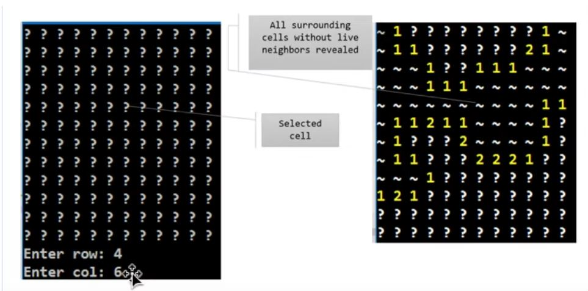

# Milestone 3: Using Recursion

## Overview

In this milestone, students will use recursion to develop an algorithm that reveals 'blocks' of cells with no live neighbors.

## Execution

Execute this assignment according to the following guidelines:

### 1.

Write a recursive definition for an algorithm that reveals 'blocks' of cells with no live neighbors in a Minesweeper game. The images above demonstrat the behavior of this algorithm.

### 2.

Add a method to the Board class called floodFill(int row, int col). This method should be recursive. Inside the floodFill method, mark cells as "visited"=true when they are included in the block of affected cells.

### 3.

The pictures above show the `~` symbol represents visited cells.
