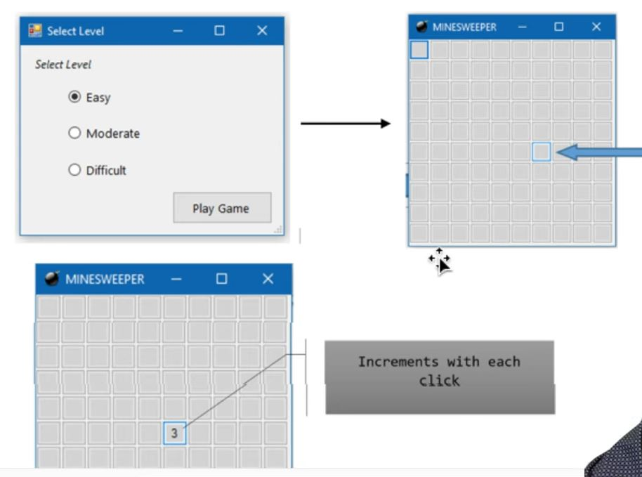

# Milestone 4: GUI Version

## Overview

In this milestone, students will create a GUI version of the Minesweeper Game.

## Execution

Execute this assignment according to the following guidelines:

### 1.

Using the Chess board activity as a model, create a Windows Form that displays a grid of clickable cells.

### 2.

For this phase of the project, you do not have to incorporate Board or Cell classes. Focus your attention on building an organized GUI. In the following milestone, we will integrate the Cell and Board classes into the solution. Create two forms.

### 3.

Create a form that prompts the user for a level of difficulty. Open a second form after the user selects an option.

### 4.

On the second form, dynamically create a grid of buttons when the form loads. Associate a single method to handle click events on all of the buttons in the grid. The method should do something visual when the button is clicked such as change the color of the button or increment a counter.
