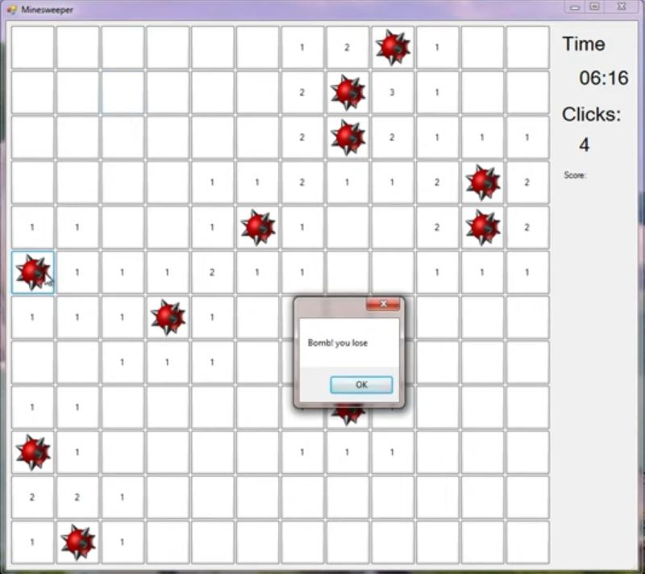

# Milestone 5: Combining GUI and Game Logic

## Overview

In this milestone, students will add the game play logic to their GUI application

## Execution

Execute this assignment according to the following guidelines:

### 1.

Create a Winforms solution in Visual Studio.

### 2.

Import the console app as a second project to the new solution. The second project should bea copy of the existing console app project which includes Board and Cell classes. The main program console app file is no longer needed.

### 3.

The new Form in the GUI applicaion will accomplish the tasks that the console app did including getting input and displaying the board. However, the new interfaces uses buttons instead of printed text to communicate with the user. The text or image on each button will depend on the value stored in the Board class.

### 4.

There are several 'expected' features in the classic Minesweeper game. Be sure to implement these into the project:  
**A.** If a user clicks on a mine, the entire game board is revealed with 'bomb' pictures on the mines and a 'Game Over' message displays. 
**B.** If a user successfully exposes all squares without clicking on a mine, the entire game board is revealed with 'flag' pictures on the mines and a 'You Win' message displays. 
**C.** If a user right-clicks on a square, a 'flag' picture is placed on the square. Right-click has not been demonstrated in previous tutorials so you will have to research how to do the right-click event.

### 5.

Add a stop watch to the application and record the length of time it takes a player to win the game. Display the elapsed time with the 'You Win' message.
