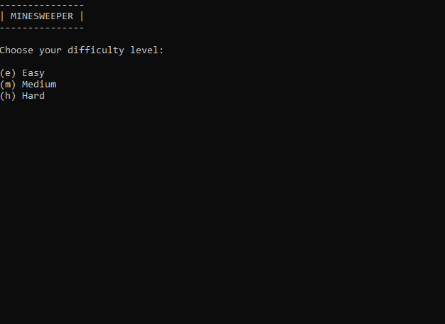
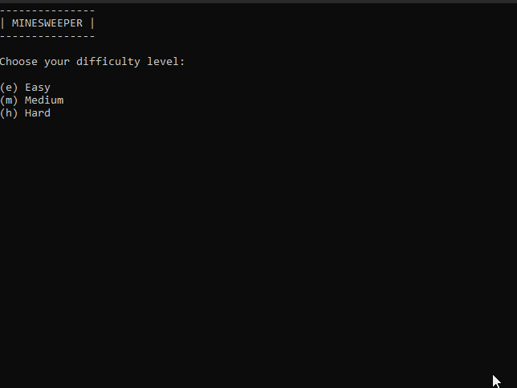
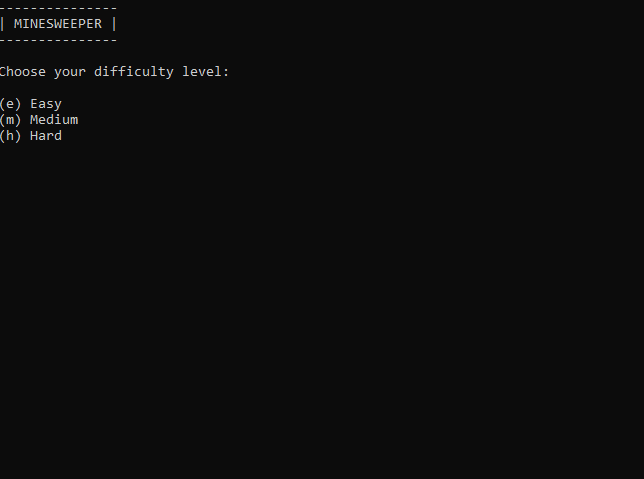
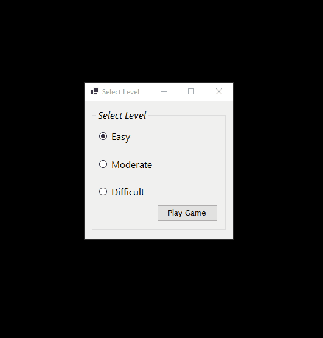

# Minesweeper Project Milestone Guide
This repository contains my solution to the Minesweeper game as outlined by Shad Sluiter in his [C# App Development Course](https://www.youtube.com/playlist?list=PLhPyEFL5u-i03yjAvWPwYyG6s3K0jH8QX). The GIFs below each milestone provide samples of the applications I have created, while the linked requirements outline the specifications as they were provided.

**Directions:** Throughout this course, students will incrementally design and build a Minesweeper Game.

## Contents

- [x] Milestone 1: Console Application
    - **Time:** 8.65 hr. 
    - **Requirements:** [Milestone 1 Specifications](https://github.com/kuhlekt1v/Minesweeper/blob/main/Milestone1/README.md)
    
___
- [x] Milestone 2: Interactive Playable Version
    - **Time:** 1.12 hr. 
    - **Requirements:** [Milestone 2 Specifications](https://github.com/kuhlekt1v/Minesweeper/blob/main/Milestone2/README.md)
    
___
- [x] Milestone 3: Using Recursion
    - **Time:** 2.51 hr. 
    - **Requirements:** [Milestone 3 Specifications](https://github.com/kuhlekt1v/Minesweeper/blob/main/Milestone3/README.md)
    
___
- [x] Milestone 4: GUI Version
    - **Time:** 3.16 hr. 
    - **Requirements:**[Milestone 4 Specifications](https://github.com/kuhlekt1v/Minesweeper/blob/main/Milestone4/README.md)
    
___
- [ ] Milestone 5: Combining GUI and Game Logic
- [ ] Milestone 6: PlayerStats Class
- [ ] Milestone 7: Final Project Presentation
- [ ] Uploading a Video to Youtube Instructions
